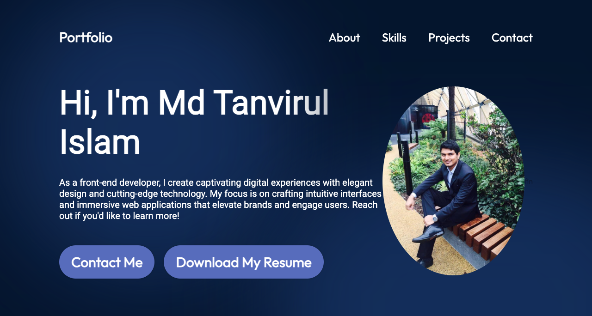
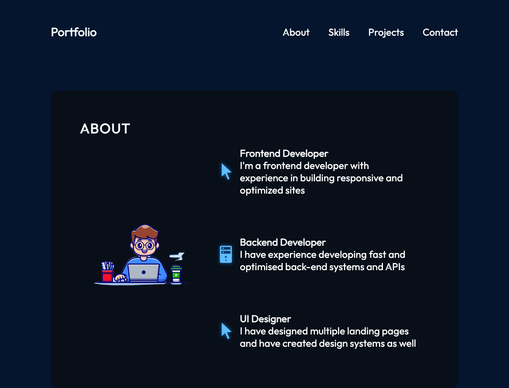
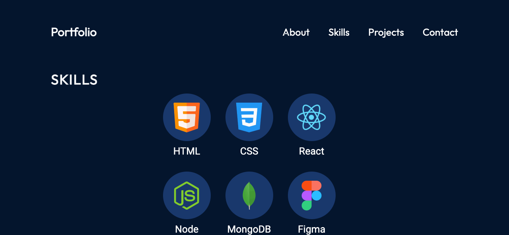
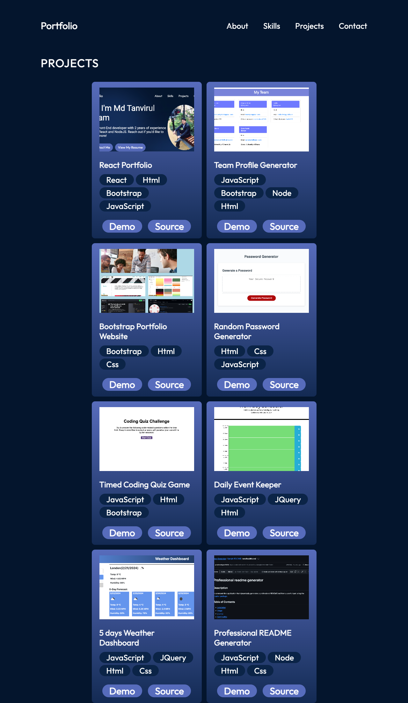
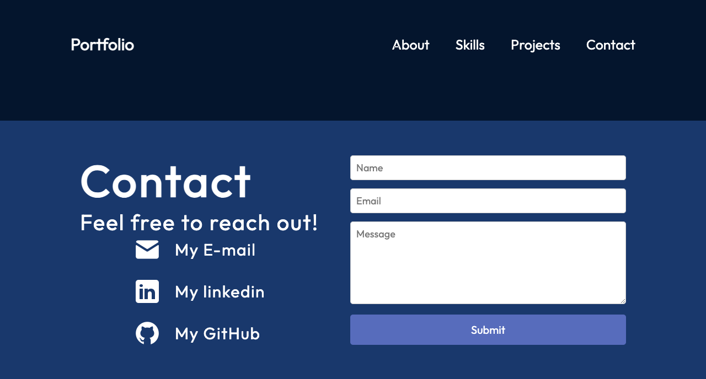

# My React Portfolio

## Description

A React Portfolio to showcase skills and projects.

## Table of Contents

- [Installation](#installation)
- [Usage](#usage)
- [License](#license)
- [Contributing](#contributing)
- [Tests](#tests)
- [Questions](#questions)

## Installation

npm create vite@4.4.1 reactpractice -- --template react
npm install
npm run dev

## Usage

React router is used as well as hooks and usestate is being used to render info and components. The site has a Navbar,Hero section,About, Skills, Projects and Contact Section. The site is extremely responsive in all screen sizes. Social links are provided in the contact section. Resume can be downloaded with a click into Download my resume button in hero section as well as sending mail to Contact me button. The React app is deployed at https://mdtanvirul-islam-9d8447.netlify.app/.
Here are the screenshots of the App being deployed:

## License

This project is licensed under the MIT license.

## Contributing

N/A

## Tests

npm run dev provides a localhost port to view the react app. No other tests are done.

## Questions

If you have any questions, please feel free to contact me:

- GitHub: [prodeveloper2023](https://github.com/prodeveloper2023)
- Email: palindrome1988@gmail.com
